# ZMK Config for Charybdis 5-Column

## Build Gallery

<table border="0" cellspacing="8" cellpadding="0">
  <tr>
    <td width="33%" valign="top">
      <a href="assets/IMG_0403.jpg">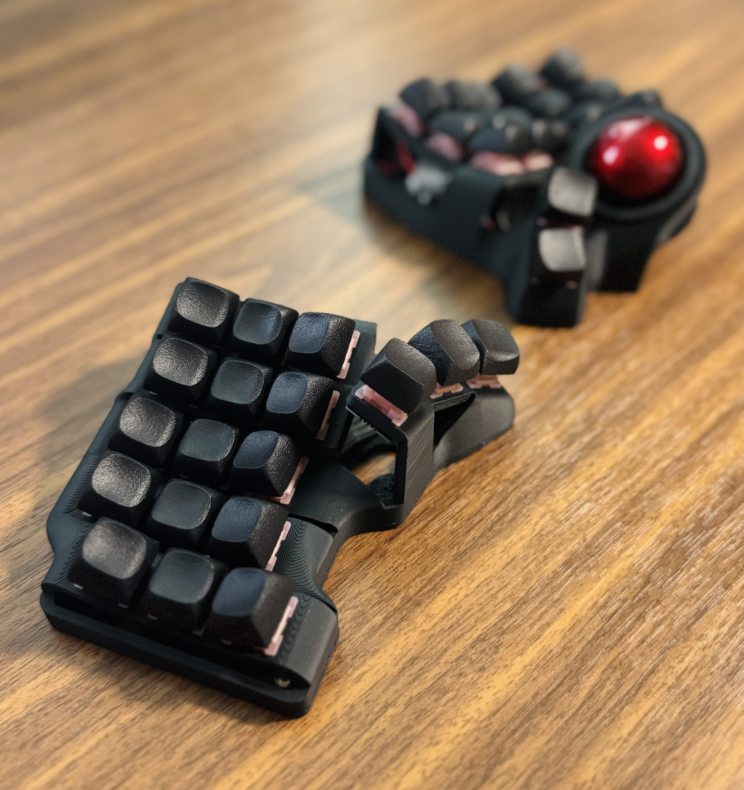</a> 
      <a href="assets/IMG_1145.jpg">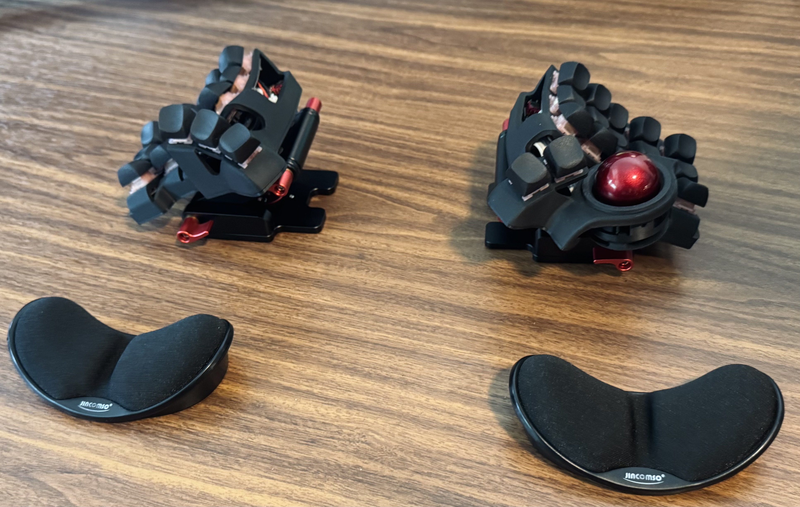</a> 
      <a href="assets/IMG_4315.jpg">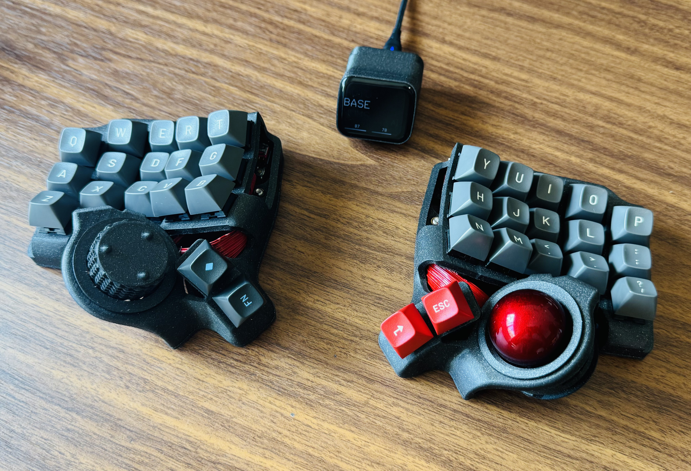</a> 
      <a href="assets/IMG_4489.jpg">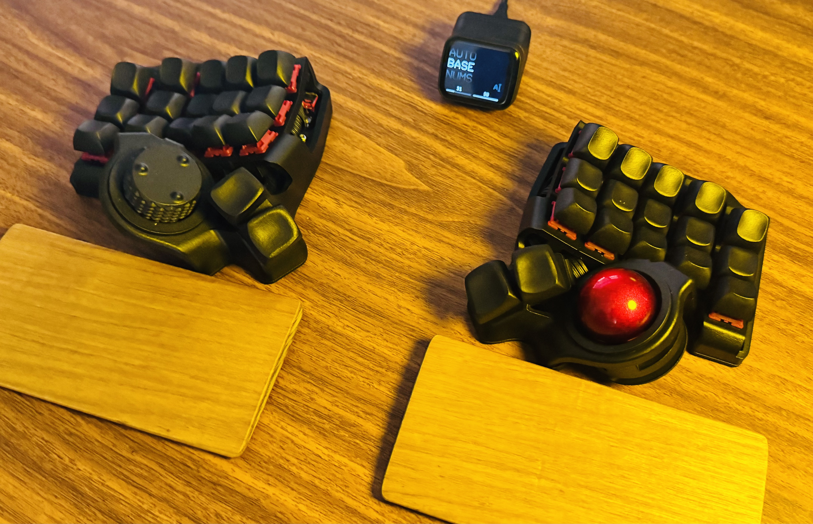</a>
    </td>
    <td width="33%" valign="top">
      <a href="assets/IMG_0404.jpg">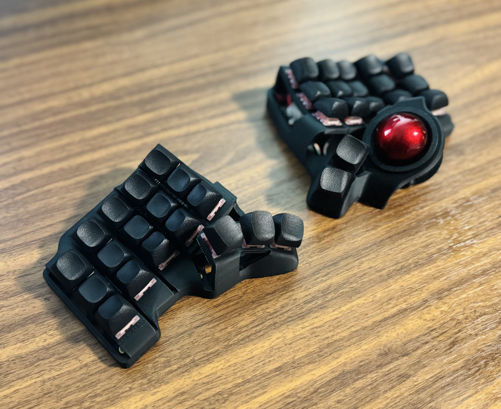</a> 
      <a href="assets/IMG_1147.jpg">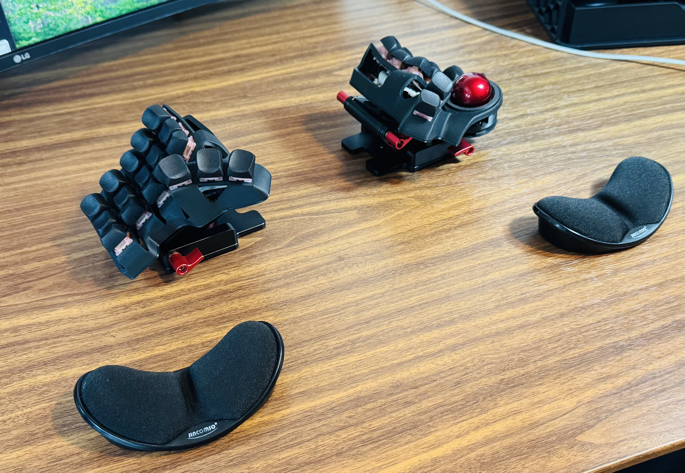</a> 
      <a href="assets/IMG_4316.jpg">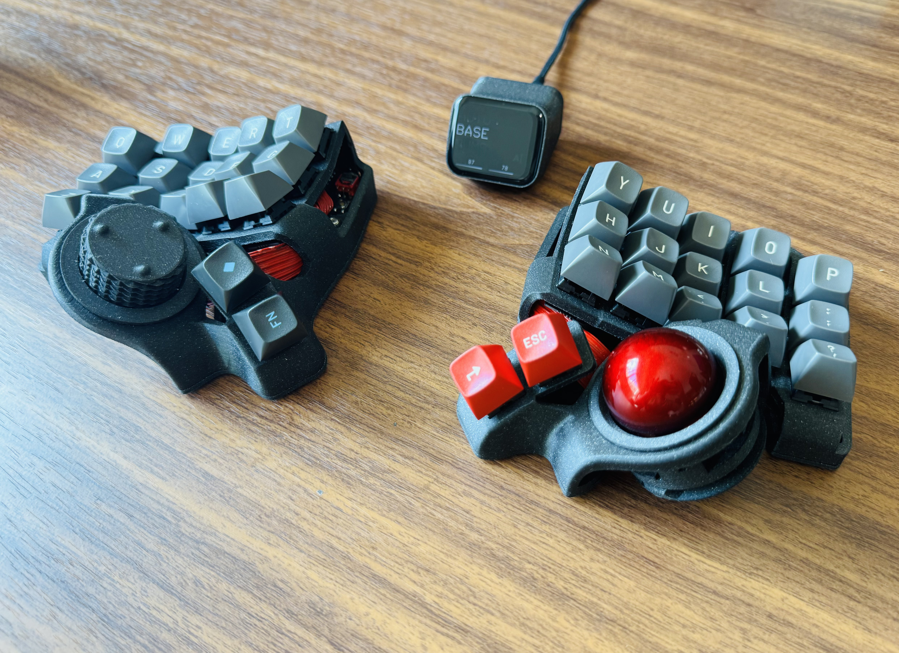</a> 
      <a href="assets/IMG_4490.jpg">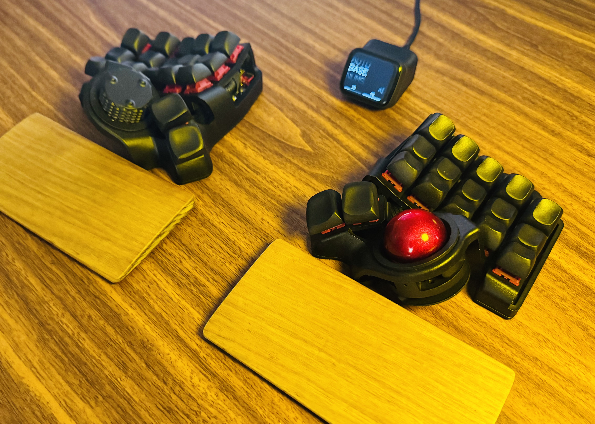</a>
    </td>
    <td width="33%" valign="top">
      <a href="assets/IMG_0405.jpg">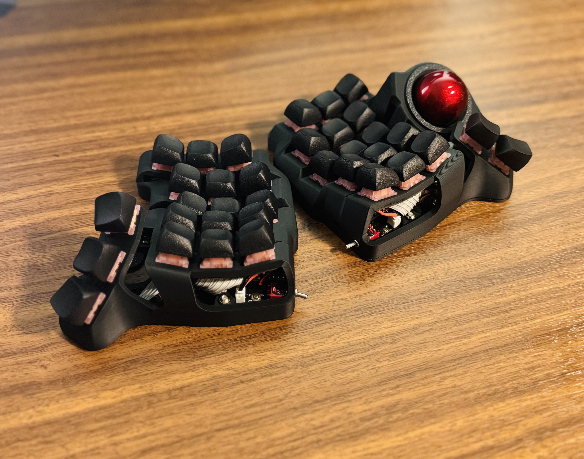</a> 
      <a href="assets/IMG_3651.jpg">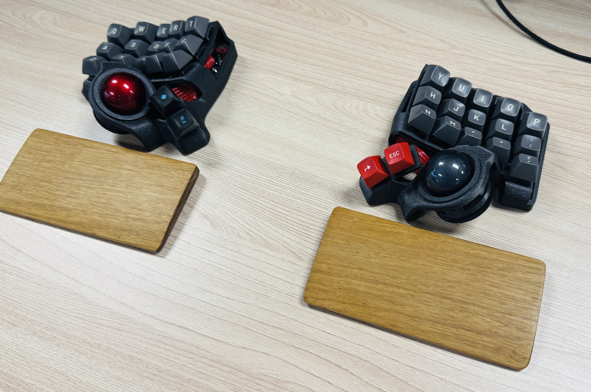</a> 
       
      <a href="assets/IMG_4491.jpg">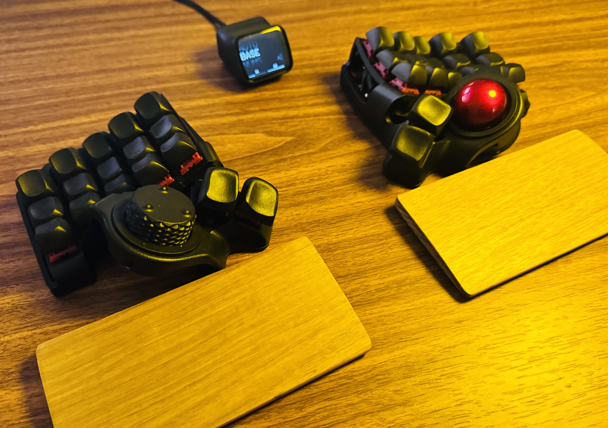</a>
    </td>
  </tr>
</table>

## Keymap

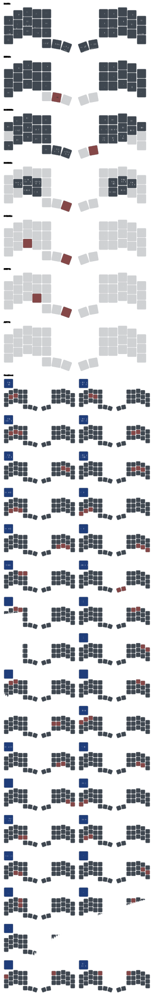
